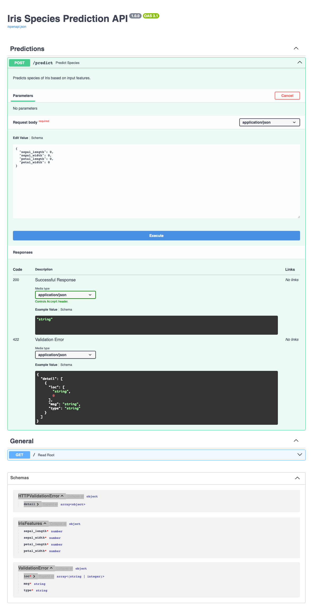

# Project: Iris Core

> A simple, robust web API built with FastAPI to serve a Scikit-learn model for Iris flower species classification. 
> This is a Tier 1 project in "The MLOps Forge" series of the Elysium Nova Project.

## Table of Contents
- [Project Overview](#project-overview)
- [Features](#features)
- [Technologies Used](#technologies-used)
- [Setup and Installation](#setup-and-installation)
- [Usage](#usage)
- [API Endpoints](#api-endpoints)
- [Screenshots](#screenshots)

## Project Overview

This project serves as a foundational example of machine learning model deployment. 
It takes a pre-trained Scikit-learn model, wraps it in a FastAPI application, and exposes a single endpoint for real-time predictions. 
The primary goal is to demonstrate the core principles of serving a model as a RESTful API, including data validation and interactive documentation.

## Features
- Real-time classification of Iris species.
- Interactive API documentation via Swagger UI.
- Input data validation using Pydantic.
- Clean, modular code structure with separate training and serving scripts.

## Technologies Used
- **Backend:** Python, FastAPI
- **ML/Data:** Scikit-learn, Pandas, Joblib
- **Server:** Uvicorn

## Setup and Installation

This project is part of a larger monorepo. To clone only this specific project, please follow these steps using Git's Sparse Checkout feature.

1. **Create and navigate into a new directory for the project:**
   ```bash
   mkdir iris-core
   cd iris-core
   ```
2. **Initialize an empty Git repository:**
   ```bash
   git init
   ```
3. **Connect to the remote Elysium-Nova repository:**
   ```bash
   git remote add origin [https://github.com/PineappleBirch/Elysium-Nova.git](https://github.com/PineappleBirch/Elysium-Nova.git)
   ```
4. **Enable Sparse Checkout and define the project path:**
   ```bash
   git config core.sparseCheckout true
   echo "The MLOps Forge - Machine Learning/Tier 1/iris-core/" >> .git/info/sparse-checkout
   ```
5. **Pull the project files:**
   ```bash
   git pull origin main
   ```
6. **Navigate to the final project directory and proceed with setup:**
   ```bash
   cd "The MLOps Forge - Machine Learning/Tier 1/iris-core"
   python -m venv venv
   source venv/bin/activate
   pip install -r requirements.txt
   ```

## Usage
To run the application, execute the following command from the root of the project directory:
```bash
uvicorn main:app --reload
```
The API will be available at `http://127.0.0.1:8000`. You can access the interactive documentation at `http://127.0.0.1:8000/docs`.

## API Endpoints
The main endpoint for this application is:

| Method | Endpoint    | Description                                       |
| :----- | :---------- | :------------------------------------------------ |
| `POST` | `/predict`  | Predicts the species of an Iris flower.           |

**Request Body Example:**
```json
{
  "sepal_length": 5.1,
  "sepal_width": 3.5,
  "petal_length": 1.4,
  "petal_width": 0.2
}
```

## Screenshots
*(A screenshot of the interactive Swagger UI documentation)*

