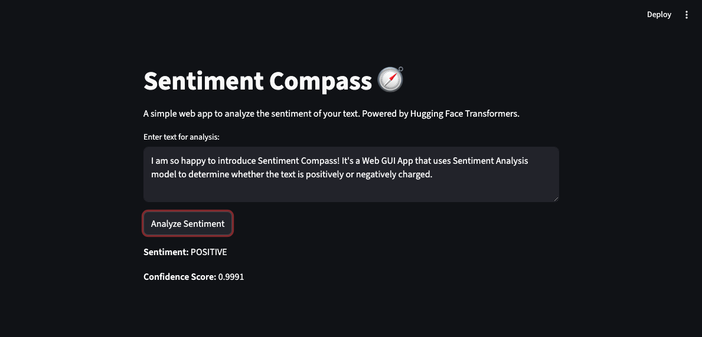
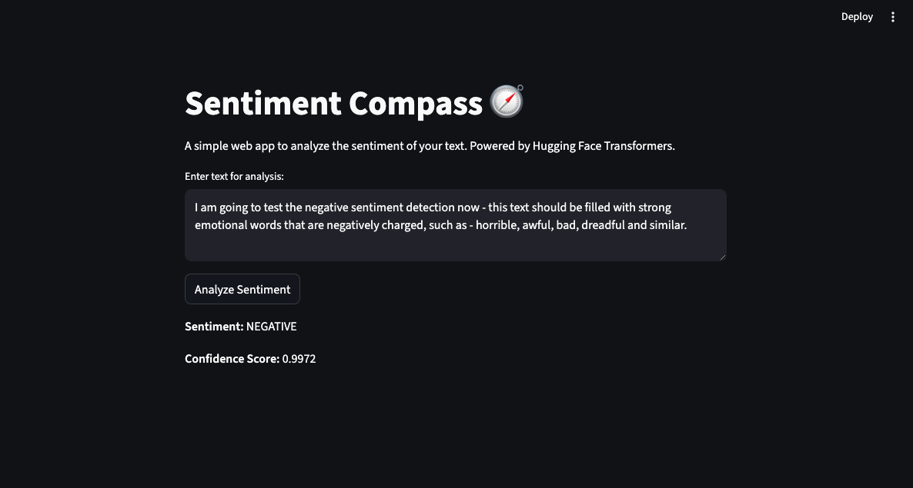

# Project: Sentiment Compass

### The MLOps Forge - Tier 2

---

## 1. Project Overview

Sentiment Compass is a web application that analyzes the sentiment of a given text. Users can input a sentence or paragraph, and the application will return a sentiment prediction (either "POSITIVE" or "NEGATIVE") along with a confidence score.

This project serves as a practical introduction to using pre-trained NLP models from the Hugging Face ecosystem and deploying them in an interactive web application with Streamlit.

## 2. Screenshot

Here is a preview of the application's user interface:

- **Positive:**



- **Negative:**



## 3. Technologies Used

- **Python 3.11+**
- **Streamlit:** For building the interactive web user interface.
- **Hugging Face `transformers`:** To download and use the pre-trained sentiment analysis model.
- **PyTorch:** As the backend framework for the transformer model.
- **Docker:** For containerizing the application for portable deployment.


## 4. Setup and Installation

This project is part of a larger monorepo. For instructions on how to clone only this specific project, please refer to the **[main repository's README.md](../../../README.md)**.

Once you have the project directory, you can proceed with the local setup:

1.  **Navigate to the project directory:**
    ```bash
    cd "The MLOps Forge - Machine Learning/Tier 2/sentiment-compass"
    ```

2.  **Create and activate a virtual environment:**
    ```bash
    python3 -m venv venv
    source venv/bin/activate
    ```

3.  **Install the required dependencies:**
    ```bash
    pip install -r requirements.txt
    ```

## 5. Running the Application

1.  **Start the Streamlit server:**
    ```bash
    streamlit run app.py
    ```

2.  The application will automatically open in a new browser tab.

## 6. Docker Deployment

This application is designed to be deployed using Docker.

1.  **Build the Docker image:**
    ```bash
    docker build -t sentiment-compass .
    ```

2.  **Run the Docker container:**
    ```bash
    docker run -p 8501:8501 sentiment-compass
    ```

3.  Access the application in your browser at `http://localhost:8501`