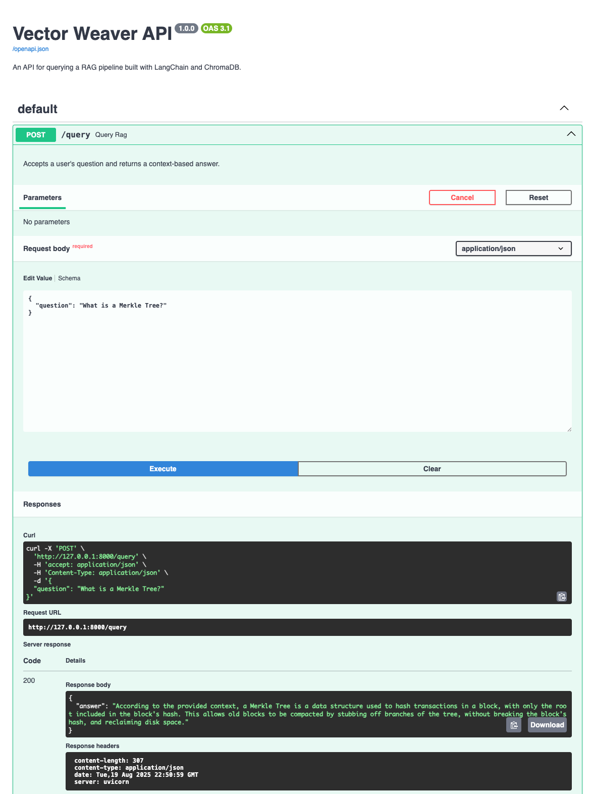
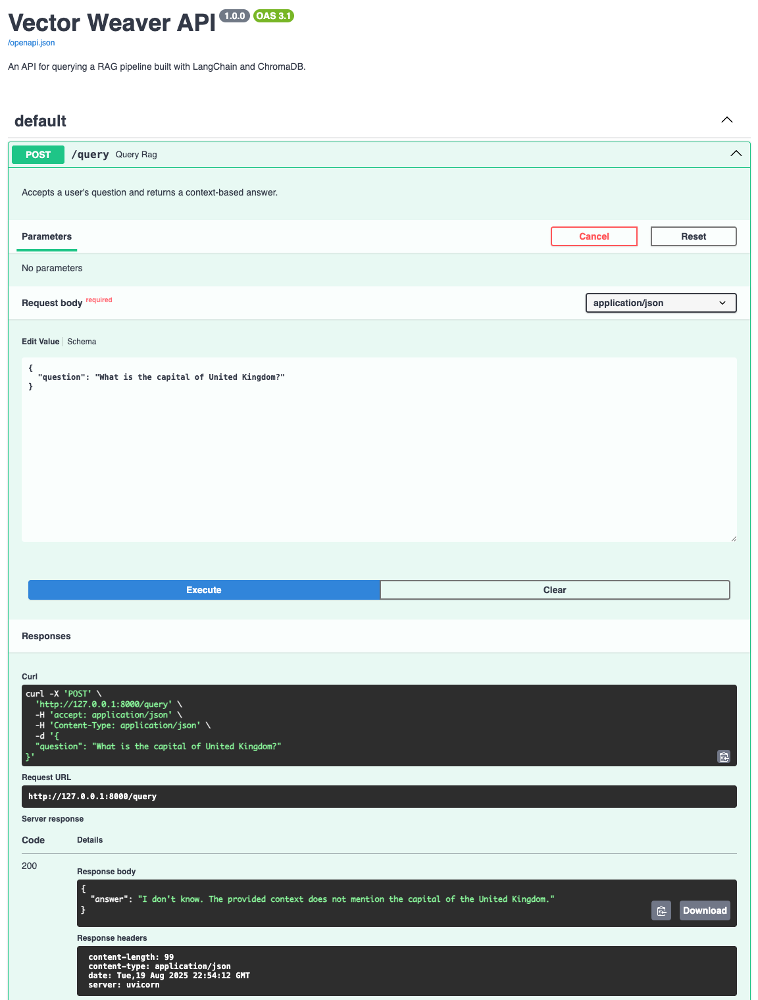
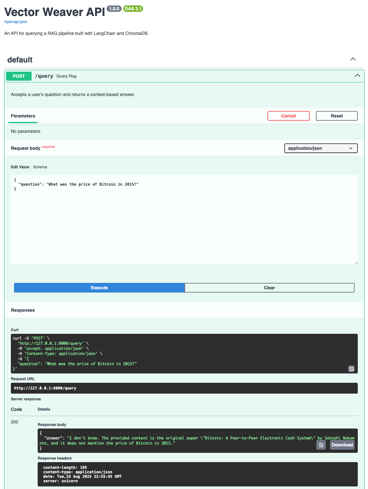

# Project: Vector Weaver

### The MLOps Forge - Tier 3

---

## 1. Project Overview

Vector Weaver is a complete Retrieval-Augmented Generation (RAG) system built with Python. It allows a user to "chat" with their documents by asking natural language questions. The application ingests a PDF, processes it into a searchable knowledge base, and uses a Large Language Model (LLM) to generate answers based solely on the document's content.

This project demonstrates a full RAG pipeline, including document loading, text splitting, vector embedding, storage in a vector database (ChromaDB), and querying via a FastAPI backend.

## 2. Key Features & Scenarios

The RAG pipeline is designed to be robust and avoid "hallucination" (making up answers).

#### A) Successful Retrieval and Answering
The model correctly answers a relevant question using context from the document.


#### B) Refusal of Irrelevant Questions
The model correctly refuses to answer an off-topic question, adhering to its instructions.


#### C) Handling of "Not Found/Unknown" Information
The model correctly states it cannot answer a relevant question when the specific information is not in the source document.


## 3. Technologies Used

- **Python 3.11+**
- **FastAPI:** For building the web server and API endpoint.
- **LangChain:** As the main framework to orchestrate the RAG pipeline.
- **Groq:** For providing the high-speed LLM (Llama 3).
- **Hugging Face Transformers:** For the `all-MiniLM-L6-v2` sentence embedding model.
- **ChromaDB:** As the local vector database for storing and retrieving document embeddings.
- **`pypdf`:** For loading and parsing the source PDF document.
- **Docker:** For containerizing the final application.

## 4. Setup and Installation

This project is part of a larger monorepo. For instructions on how to clone only this specific project, please refer to the **[main repository's README.md](../../../README.md)**.

### 4.1. Local Setup

1.  **Navigate to the project directory:**
    ```bash
    cd "The MLOps Forge - Machine Learning/Tier 3/vector-weaver"
    ```

2.  **Create and activate a virtual environment:**
    ```bash
    python3 -m venv venv
    source venv/bin/activate
    ```

3.  **Install the required dependencies:**
    ```bash
    pip install -r requirements.txt
    ```

4.  **Set up Environment Variables:**
    - Create a file named `.env` in the project root.
    - Add your Groq API key to it in the following format:
      ```
      GROQ_API_KEY="your_api_key_here"
      TOKENIZERS_PARALLELISM=false
      ```

## 5. Usage

The application runs in two stages: Ingestion and Querying.

### 5.1. Step 1: Ingest Data

Before you can ask questions, you must run the ingestion script to process your source document.

1.  Place a PDF file inside the `data/` directory.
2.  Run the ingestion script:
    ```bash
    python ingest.py
    ```
    This will create a `vector_db/` directory containing the knowledge base. You only need to do this once per document.

### 5.2. Step 2: Run the API Server

1.  Start the FastAPI server with Uvicorn:
    ```bash
    uvicorn app:app --reload
    ```

2.  Access the interactive API documentation (Swagger UI) in your browser at **`http://127.0.0.1:8000/docs`** to ask questions.

## 6. Docker Deployment

1.  **Build the Docker image:**
    ```bash
    docker build -t vector-weaver .
    ```

2.  **Run the Docker container:**
    ```bash
    docker run -p 8000:8000 --env-file .env vector-weaver
    ```
    *Note: The `--env-file .env` flag securely passes your API key to the container.*