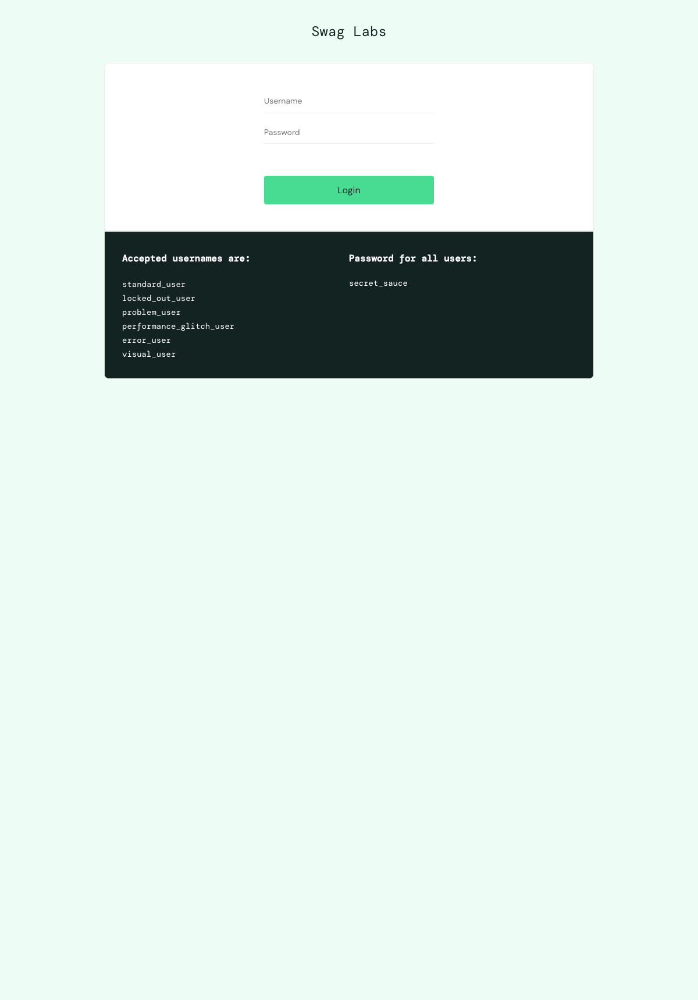
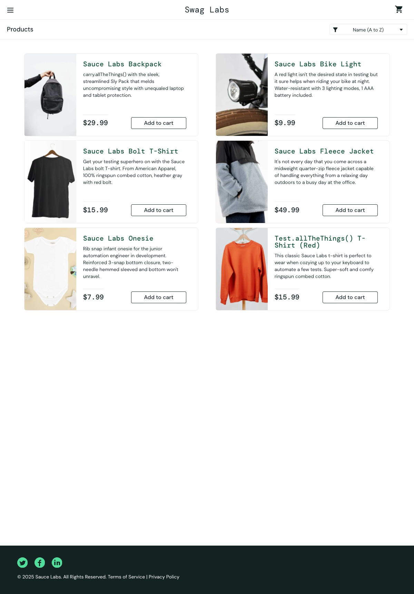
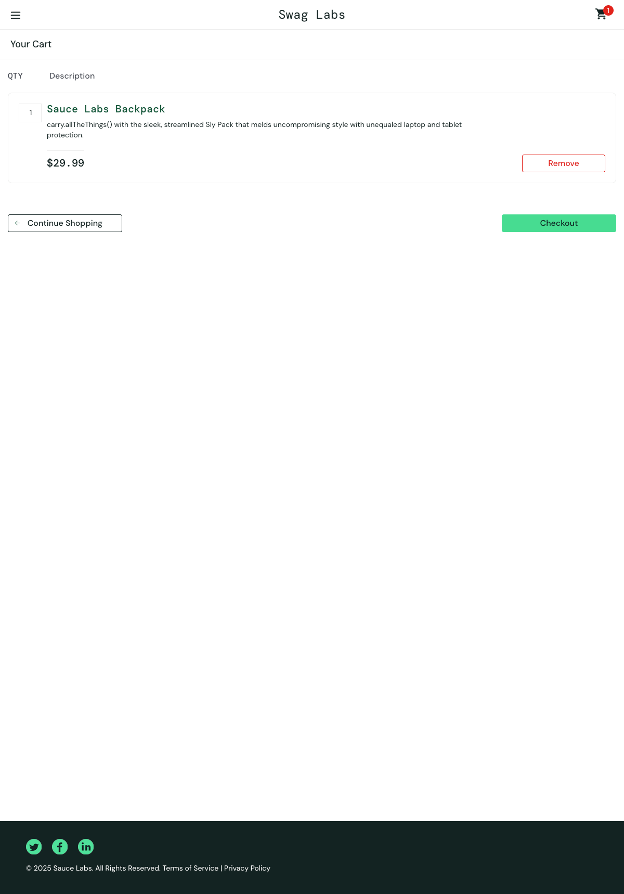
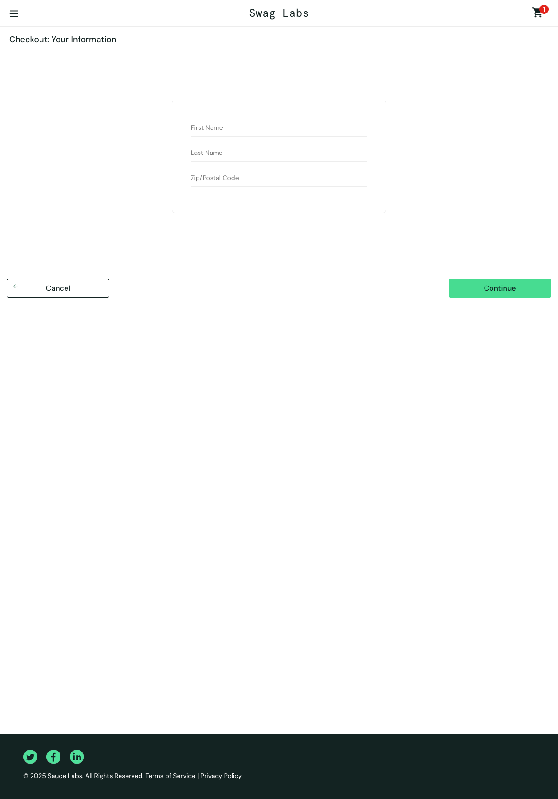

# Project: Citadel Blueprint

> A comprehensive manual test suite for the Sauce Demo e-commerce website. This is a Tier 1 project in "The Quality Citadel" series of the Elysium Nova portfolio, focused on demonstrating foundational test design and documentation skills.

## Project Overview

The goal of this project is to showcase the ability to analyze a web application, identify key features, and design a structured and thorough set of manual test cases. The test suite covers the login, inventory, and checkout functionalities of the Sauce Demo website, including positive ("happy path") and negative test scenarios.

The complete test suite was designed in Notion and then exported to a self-contained HTML file for easy viewing within this repository. The test credentials used (`standard_user`, etc.) are provided publicly on the application's login page.

## Setup and Installation

This project is part of a larger monorepo. To clone only this specific project, please follow these steps using Git's Sparse Checkout feature.

1. **Create and navigate into a new directory for the project:**
   ```bash
   mkdir citadel-blueprint
   cd citadel-blueprint
   ```
2. **Initialize an empty Git repository:**
   ```bash
   git init
   ```
3. **Connect to the remote Elysium-Nova repository:**
   ```bash
   git remote add origin [https://github.com/PineappleBirch/Elysium-Nova.git](https://github.com/PineappleBirch/Elysium-Nova.git)
   ```
4. **Enable Sparse Checkout and define the project path:**
   ```bash
   git config core.sparseCheckout true
   echo "The Quality Citadel - Quality Assurance/Tier 1/citadel-blueprint/" >> .git/info/sparse-checkout
   ```
5. **Pull the project files:**
   ```bash
   git pull origin main
   ```

## View the Test Suite

The full test suite can be viewed by opening the file below in your web browser:

* **[View the Complete Test Suite (test_suite.html)](./The%20Quality%20Citadel%20-%20Quality%20Assurance/Tier%201/citadel-blueprint/test_suite.html)**

## Technologies & Tools Used
- **Test Case Management:** Notion
- **Documentation:** Markdown, HTML

## Target Application Preview

Here are a few screenshots of the "Sauce Demo" website that was tested.

**Login Page:**


**Inventory Page:**


**Shopping Cart Page:**


**Checkout Page:**
