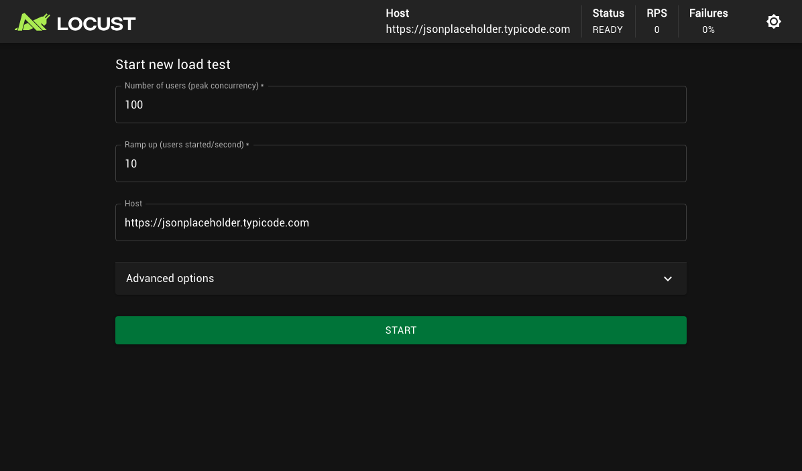
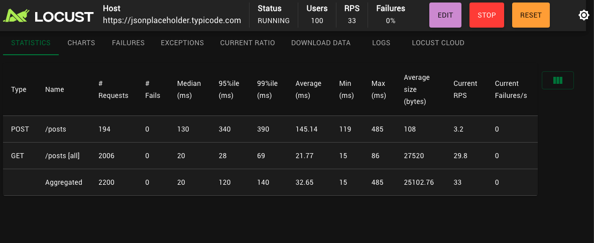
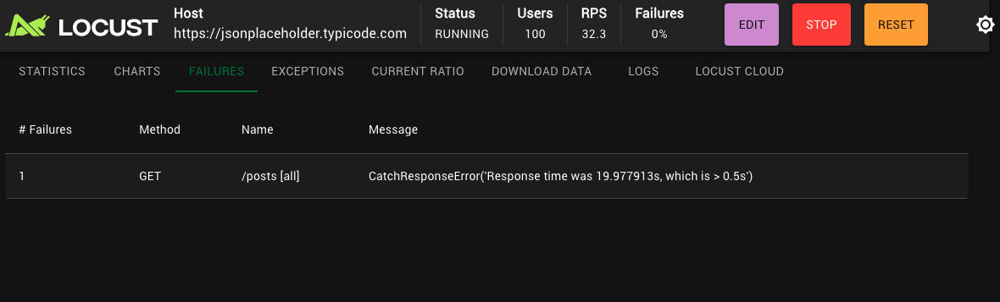
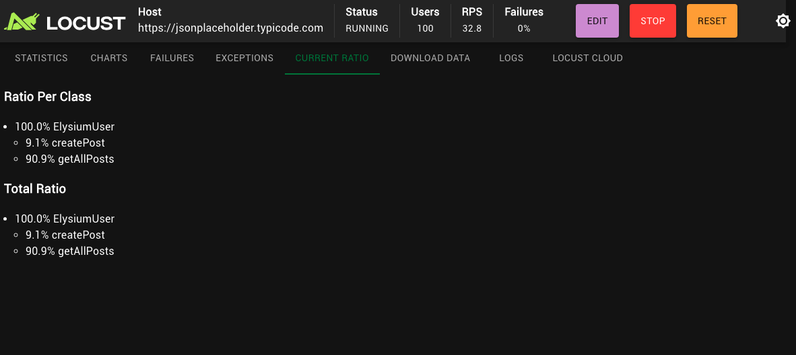

# Project: Citadel Siege

> A Tier 3 project in "The Quality Citadel" series. This project introduces basic performance testing using Locust, a modern, Python-based load testing tool.

## Project Overview

This project demonstrates how to write and execute a performance test suite. The goal is to simulate a swarm of virtual users accessing a public API (JSONPlaceholder) to measure its performance under load and verify that it meets predefined performance thresholds.

The test script, or `locustfile.py`, defines multiple user behaviors with different weightings to create a more realistic traffic pattern. It also includes automatic "Checks" to fail the test if the API's response time or success rate does not meet the specified requirements.

## Test Scenarios
- **Get All Posts (High Traffic):** A task that fetches all posts, weighted to be the most common user action. It includes checks to ensure the response time is under 0.5 seconds and the status code is 200 OK.
- **Create a Post (Low Traffic):** A less frequent task that creates a new post to simulate write operations.

## Technologies & Tools Used
- **Performance Testing Framework:** Locust
- **Language:** Python

## Setup and Installation
1. **Clone the repository:**
   ```bash
   git clone <your-repo-url>
   cd project-citadel-siege
   ```
2. **Create and activate a virtual environment:**
   ```bash
   python3 -m venv venv
   source venv/bin/activate
   ```
3. **Install the required dependencies:**
   ```bash
   pip install -r requirements.txt
   ```

## Usage
1. **Start the Locust server:** From the root of the project directory, run:
   ```bash
   locust -f locustfile.py
   ```
2. **Open the web interface:** Navigate to `http://localhost:8089` in your web browser.
3. **Start the test:** Enter the number of users to simulate (e.g., `100`) and a spawn rate (e.g., `10`), then click "Start swarming".

## Screenshots

**1. Test Configuration:**
*(The initial Locust setup screen where the number of users and ramp up rate are defined.)*



**2. Live Statistics:**
*(The "Charts" tab during a test run, showing real-time RPS and response times.)*



**3. Failures Report:**
*(The "Failures" tab showing an example of a request that failed a performance check.)*



**4. Task Ratio:**
*(The "Current Ratio" tab showing the real-time execution ratio of different user tasks.)*

