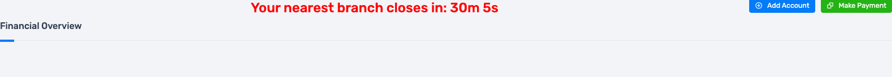

# Project: Citadel Watchtower

> A Tier 4 project in "The Quality Citadel" series. This project establishes an automated visual regression testing suite using Python, pytest, and Selenium.

## Project Overview

This project demonstrates how to build an automated system for detecting visual bugs in a web application. The suite is designed to capture "baseline" screenshots of key pages in a known good state and then compare them against new screenshots taken during a test run.

The framework is built to be resilient, handling common issues like browser window size inconsistencies and minor rendering differences caused by anti-aliasing on high-DPI displays. If a significant visual difference is detected, the test fails and a "diff" image is generated, which visually highlights the exact pixels that have changed.

## Test Scenarios
- **Happy Path:**
  - Verifies that the standard login page matches its baseline.
  - Verifies that the main application page (after login) matches its baseline.
- **Bug Detection:**
  - Verifies that a change in an element's color is detected.
  - Verifies that a hidden element is detected as a visual difference.
  - Verifies that the suite can detect pre-existing visual bugs in a "V2" of the application.

## Technologies & Tools Used
- **Testing Framework:** pytest
- **Browser Automation:** Selenium
- **Image Comparison:** Pillow, pixelmatch
- **Language:** Python

## Setup and Installation

This project is part of a larger monorepo. For instructions on how to clone only this specific project, please refer to the **[main repository's README.md](../../../README.md)**.

Once you have cloned the project, you can proceed with the setup:

1. **Navigate to the project directory:**
   ```bash
   cd "The Quality Citadel - Quality Assurance/Tier 4/citadel-watchtower"
   ```
2. **Create and activate a virtual environment and install dependencies:**
   ```bash
   python3 -m venv venv
   source venv/bin/activate
   pip install -r requirements.txt
   ```

## Usage
1. **(Optional) Recapture Baseline Images:** If you make intended visual changes, run this script to generate new baseline images:
   ```bash
   python capture_baselines.py
   ```
2. **Run the Visual Tests:**
   ```bash
   pytest
   ```

## Screenshots & Diffs 
<br>

### Login Page

**Baseline (Correct State):**


**Detected Bug 1 (Changed Color):**


Diff:


**Detected Bug 2 (Hidden Element):**


Diff:


<br>

### Main Application Page

**Baseline (Correct State):**


**Detected Bug (Hidden Element):**



Diff:
